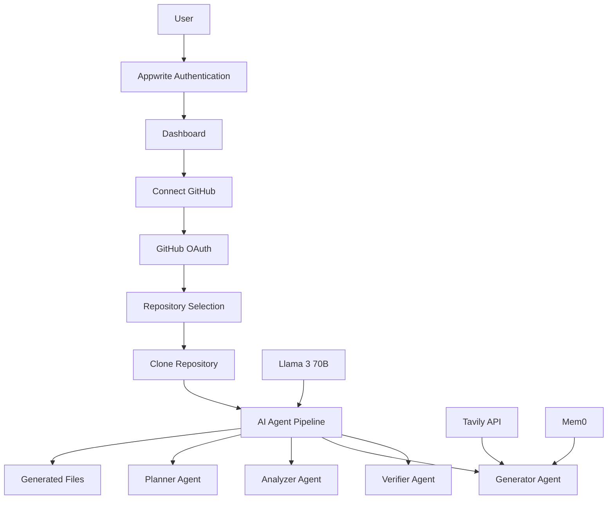

# DevPilotAI Architecture Overview

## 🏗️ System Architecture

DevPilotAI uses a clean separation of concerns with distinct services handling different aspects of the platform:

### Authentication vs Repository Access

**IMPORTANT DISTINCTION:**
- **User Authentication**: Handled by Appwrite (login/signup/sessions)
- **Repository Access**: Handled by GitHub API service (repo discovery/cloning)

These are TWO SEPARATE systems working together!

## 🔐 Authentication Layer (Appwrite)

### Purpose
- User registration and login
- Session management
- User profile storage
- OAuth integration for user authentication

### Features
- Email/Password authentication
- GitHub OAuth (for user login)
- Google OAuth (optional)
- Secure session management
- User preferences storage

### Environment Variables
```bash
APPWRITE_ENDPOINT=https://cloud.appwrite.io/v1
APPWRITE_PROJECT_ID=your-project-id
APPWRITE_API_KEY=your-api-key
```

### OAuth Callback URLs
- GitHub: `https://cloud.appwrite.io/v1/account/sessions/oauth2/callback/github`
- Google: `https://cloud.appwrite.io/v1/account/sessions/oauth2/callback/google`

## 🐙 GitHub Integration Layer

### Purpose
- Repository discovery and access
- Clone repositories for analysis
- Fetch user's repositories and organizations
- Handle private repository access

### Why Separate from Appwrite?
- Appwrite OAuth is for USER authentication
- GitHub API access is for REPOSITORY operations
- Users need fine-grained repo permissions
- Enables access to private repositories

### Environment Variables
```bash
GITHUB_CLIENT_ID=your-github-oauth-app-client-id
GITHUB_CLIENT_SECRET=your-github-oauth-app-secret
GITHUB_REDIRECT_URI=https://your-backend.com/auth/github/callback
JWT_SECRET=your-jwt-secret
```

### OAuth Callback URL
- GitHub OAuth App: `https://your-backend.com/auth/github/callback`

## 🤖 AI Processing Layer

### Multi-Agent System (LangGraph)
- **Planner Agent**: Repository structure analysis
- **Analyzer Agent**: Tech stack detection
- **Generator Agent**: CI/CD file creation
- **Verifier Agent**: Configuration validation

### AI Services
- **Llama 3 70B** (Novita.ai): Core AI reasoning
- **Tavily API**: Real-time documentation search
- **Mem0**: User interaction memory
- **Keywords AI**: Observability (optional)

### Environment Variables
```bash
LLAMA_API_KEY=your-novita-ai-key
TAVILY_API_KEY=your-tavily-key
MEM0_API_KEY=your-mem0-key
KEYWORDS_AI_API_KEY=your-keywords-ai-key
```

## 🔄 Complete User Flow

### 1. User Authentication (Appwrite)
```
User → Login/Signup → Appwrite → Dashboard
```

### 2. GitHub Repository Connection
```
User → Connect GitHub → GitHub OAuth → Repository Access
```

### 3. Repository Analysis
```
Select Repo → Clone → AI Analysis → Generate Files
```

### 4. Real-time Updates
```
Analysis Progress → WebSocket → Live Updates → Completion
```

## 📊 Data Flow



## 🌐 Deployment Architecture

### Frontend (Vercel)
- React application
- Environment variables for Appwrite and API URLs
- Static asset serving

### Backend (Render)
- Node.js Express server
- WebSocket support for real-time updates
- All environment variables configured

### External Services
- **Appwrite Cloud**: Authentication and database
- **GitHub**: Repository access and OAuth
- **Novita.ai**: AI model hosting
- **Tavily**: Search API
- **Mem0**: Memory storage

## 🔧 Environment Setup Checklist

### Appwrite Project
- [ ] Create project at cloud.appwrite.io
- [ ] Enable Email/Password auth
- [ ] Configure GitHub OAuth provider
- [ ] Set callback URL: `https://cloud.appwrite.io/v1/account/sessions/oauth2/callback/github`
- [ ] Get Project ID and API Key

### GitHub OAuth App
- [ ] Create OAuth app in GitHub Developer Settings
- [ ] Set Homepage URL: `https://your-frontend.com`
- [ ] Set Callback URL: `https://your-backend.com/auth/github/callback`
- [ ] Get Client ID and Secret

### API Keys
- [ ] Novita.ai account and API key
- [ ] Tavily API key
- [ ] Mem0 API key
- [ ] Keywords AI key (optional)

## 🚨 Common Misunderstandings

### ❌ Wrong: "Remove GitHub OAuth since Appwrite handles auth"
- Appwrite handles USER authentication
- GitHub OAuth is for REPOSITORY access
- These serve different purposes

### ❌ Wrong: "All environment variables are for authentication"
- Authentication: Appwrite variables
- Repository access: GitHub variables
- AI processing: API key variables

### ✅ Correct: Two OAuth Systems
1. **Appwrite GitHub OAuth**: User login to the platform
2. **GitHub API OAuth**: Repository access after login

## 🔍 Debugging Guide

### Authentication Issues
- Check Appwrite project configuration
- Verify OAuth provider settings
- Ensure correct callback URLs

### Repository Access Issues
- Check GitHub OAuth app configuration
- Verify GitHub API scopes (`repo`, `user:email`)
- Test GitHub token permissions

### AI Processing Issues
- Verify API keys are valid
- Check rate limits on external services
- Monitor agent pipeline logs

This architecture ensures security, scalability, and clear separation of concerns while providing a seamless user experience. 